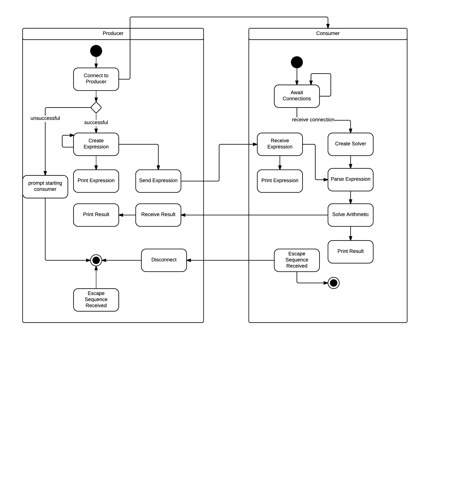
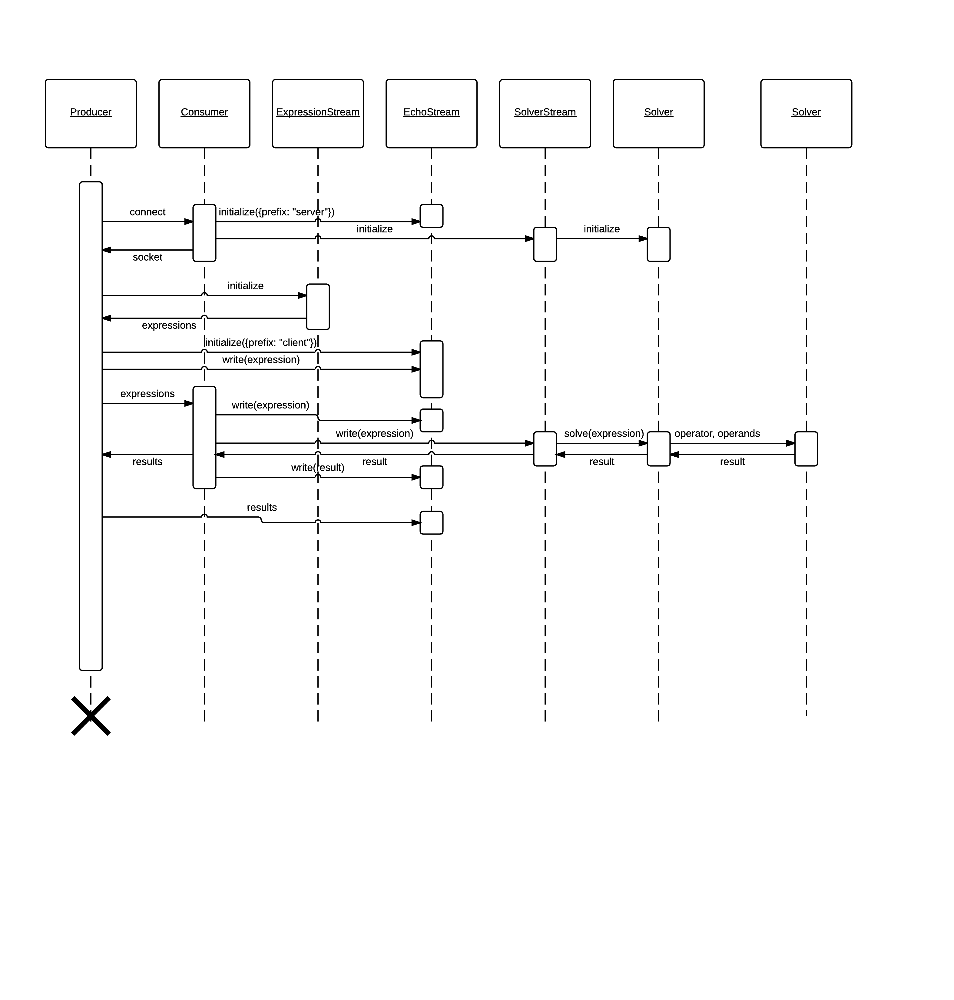

# Math Challenge

This project is a simple producer and consumer system for passing and solving arithmetic instructions

## Installation
This project should work on any Unix environment which has Node >= ```v0.12.7``` installed.

To install the project, just run ```npm install``` from the project root directory.

## Usage
You should first start the consumer by running ```node consumer.js``` from the project root.

You can then start the producer by running ```node producer.js```. You can start multiple producers and each one will send requests at a rate of approximately 10 expressions per second.

## Limitations
Currently, only addition and substraction positive integers is supported. A single expression can only include a maximimum of one operator (addition or subtraction) and two operands.

## Testing
Project tests are powered by Mocha and Chai. Tests can then be run with: ```npm test```.

## Design & Decisions
This system is designed to use 4 main classes:

* **EchoStream** logs information to stdout.
* **ExpressionStream** generates random expressions.
* **SolverStream** transforms expressions into results, using **Solver**.
* **Solver** parses expressions and computes their results.

I made a few key decisions in my implementation:

* It is entirely based around streams, which are well-supported in Node.
* Communication is done over HTTP, using the build-in module.
* A simple regular expression is used for parsing expressions, as the required functionality is quite limited. If more functionality were demanded, I'd use a full syntax tree parser like [math.js](http://mathjs.org/).
* Only addition and subtraction are supported, to keep things simple.
* If the Consumer receives an invalid message, it will always respond with "invalid expression."

### UML Activity Diagram


### UML Sequence Diagram

